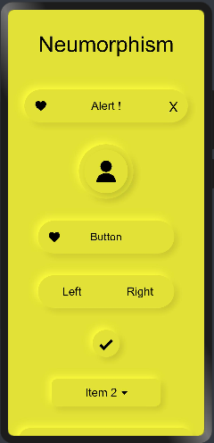

# Neumorphism_Theme

一Neumorphism Theme design for OpenHarmony.

## Download & Install

Install using npm

```npm i hmos-neumorphism ```
Details about OpenHarmony NPM environment configuration, see at [here](https://gitee.com/openharmony-tpc/docs/blob/master/OpenHarmony_npm_usage.md)

## Usage Instructions
# Note :

Add this css snippet when passing input or button through slot .

```css
button, input{
    width: 100%;
    height: 100%;
    background-color:transparent;
    text-color: black;
}
```

# Theme

<p float="left">



</p>

Import:
```html
<element name='neutheme' src='hmos-neumorphism/theme/theme.hml'></element>
```

Usage:
```html

<!--You can choose between following themes:-->

<!--white-->
<!--silver-->
<!--gray-->
<!--black-->
<!--red-->
<!--maroon-->
<!--yellow-->
<!--olive-->
<!--lime-->
<!--green-->
<!--aqua-->
<!--teal-->
<!--blue-->
<!--navy-->
<!--pink-->
<!--purple-->

<neumorphism theme="silver" color="black">
</neumorphism>
```

## Compatibility
Supports OpenHarmony API version 6 

## Directory Structure
````
|---- Neumorphism  
|     |---- entry  # sample app usage
|     |---- Neumorphism  # Neumorphism library
|           |---- theme  # Theme Component
|                 |---- theme.css  # Theme style component
|                 |---- theme.hml  # Theme hml file
|     |---- README.MD  # installation and usage                   
````
## Code Contribution
If you find any problems during usage, you can submit an [Issue](https://gitee.com/openharmony-sig/Theme/issues) to us. Of course, we also welcome you to send us [PR](https://gitee.com/openharmony-sig/Theme/pulls).

## Open source License
This project is based on [Apache License 2.0](https://gitee.com/openharmony-sig/Theme/blob/master/LICENSE.txt) ，please enjoy and participate in open source freely.

# Reference:

<a href="https://neumorphism.io/">neumorphism.io</a>

<a href="https://ismail9k.github.io/neomorphism/">ismail9k.github.io/neomorphism</a>
